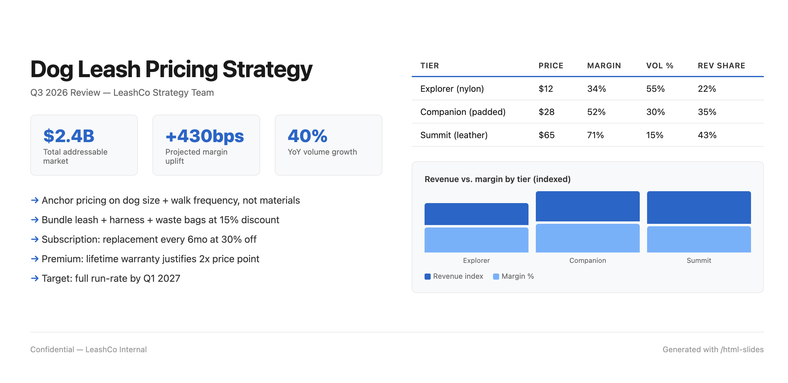
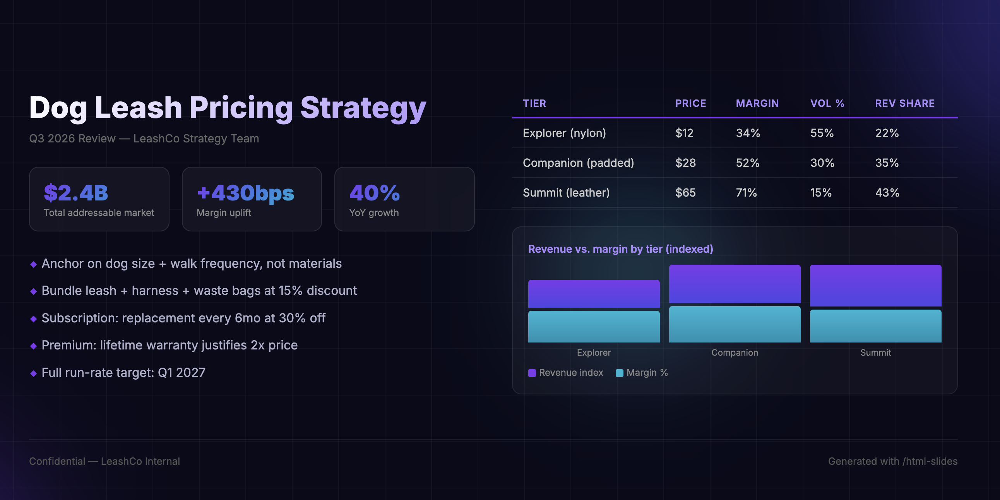
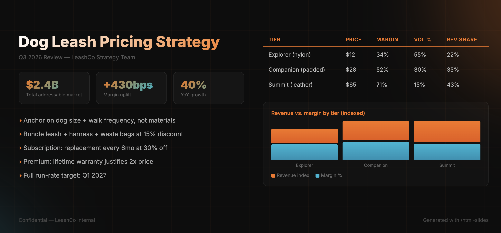

# Leverage and Taste — A Claude Code Setup

Automate the legwork, enhance your taste.

---

A [Claude Code](https://docs.anthropic.com/en/docs/claude-code) setup for product managers and knowledge workers. Slash commands, operating rules, and a knowledge base architecture that compounds over time.

Assembled over months of daily use, drawing on open-source work from others (Dan Shipper's AI workflow principles, various Claude Code community patterns) and refined through real PM work: strategy docs, competitive research, contribution tracking, meeting notes, and domain knowledge bases.

Copy what's useful, ignore what isn't. MIT licensed.

## Philosophy

Your taste — the judgment about what to cut, what to push on, what's actually good vs. merely competent — is the thing worth protecting and developing. AI can do a lot of the legwork (research, formatting, first drafts, recaps), and it should. But the more you delegate, the more deliberate you need to be about staying in the driver's seat on the decisions that matter.

This setup does two things:

1. **Frees up your time** by automating repetitive knowledge work (weekly recaps, feedback extraction, doc reviews, meeting notes, competitive research).
2. **Keeps you sharp** with 16 operating rules that prevent you from going passive — accepting the first draft, skipping the hard thinking, letting AI make choices you should be making.

The session system (`/go` + `/ho`) solves a practical problem: Claude forgets everything between sessions. These commands make context persist so the 50th conversation is more useful than the first.

## Prerequisites

- **Claude Code** installed and working (the [CLI tool from Anthropic](https://docs.anthropic.com/en/docs/claude-code))
- **Git** (for cloning; also used by `/ho` to check for uncommitted work)
- Basic familiarity with Claude Code (you've used it at least a few times)

## Key concepts (if you're new to Claude Code)

| Concept | What it means |
|---------|--------------|
| **Slash commands** | Reusable prompts you trigger with `/name` in Claude Code. Stored as markdown files in `~/.claude/commands/`. |
| **CLAUDE.md** | A file Claude Code reads automatically at the start of every session. Put rules, preferences, and context here. Lives at `~/.claude/CLAUDE.md` (global) or `<project>/.claude/CLAUDE.md` (per-project). |
| **MCP** | Model Context Protocol — a way to connect Claude Code to external tools (calendar, Slack, Google Drive, etc). Optional; commands work without it. |
| **SESSION_LOG.md** | A markdown file where `/ho` writes what happened each session. Next time you `/go`, Claude reads it and picks up where you left off. |

## How to integrate into your workflow

### Option A: Copy individual commands (recommended start)

Pick 2-3 commands that solve an immediate problem:

```bash
# Copy just the ones you want
cp commands/ho.md ~/.claude/commands/
cp commands/go.md ~/.claude/commands/
cp commands/style-review.md ~/.claude/commands/
```

They're immediately available as `/ho`, `/go`, `/style-review` in Claude Code.

### Option B: Full installation

```bash
git clone https://github.com/cipshadow/leverage-and-taste.git
cd leverage-and-taste

# Copy all commands
cp commands/*.md ~/.claude/commands/

# Copy operating rules (read first, adapt to your style)
cp CLAUDE.md ~/.claude/CLAUDE.md
```

**After copying:**

1. **Configure `/go`** — open `~/.claude/commands/go.md` and replace the example project table with your own projects and paths.
2. **Create a `SESSION_LOG.md`** in your workspace root. `/ho` appends to it; `/go` reads from it. That's all you need.

### Option C: Just read the operating rules

The `CLAUDE.md` file contains 16 rules for working with AI effectively. Read it, adapt what resonates, paste relevant bits into your own `~/.claude/CLAUDE.md`. The rules work whether or not you use any of the commands.

## The commands

### `/go` and `/ho` (handoff) — session pair

These two work together. `/go` starts a session by loading project context. `/ho` (short for "handoff") ends it by saving what happened.

```
/go myproject    → reads SESSION_LOG.md + CONTEXT.md, you're caught up
  ... do work ...
/ho              → checks for loose ends, writes session entry, runs /coach
```

That's the core loop. `/ho` writes what happened; next time you `/go`, Claude knows where you left off without you explaining.

**First time?** Create a `SESSION_LOG.md` in your workspace. Run `/ho` at the end of a session. Done — the compounding starts.

### Session and thinking quality

| Command | What it does |
|---------|-------------|
| `/go <project>` | Load a project's full context (session log + CONTEXT.md) in one step. |
| `/ho` | End session: pre-flight checks, writes SESSION_LOG entry, triggers /coach. |
| `/coach` | AI-use self-audit. Did AI shape your decisions or support them? Saves a diary entry to `diary/`. |
| `/sure` | Spawns a fresh sub-agent to review your work cold. Rates confidence 0-100, suggests fixes. Waits for your input before acting. |

<details>
<summary><strong>Example: what /coach output looks like</strong></summary>

```markdown
## 2026-06-07 — Pricing strategy session

**Decision agency: 8/10**
You drove the framing and rejected the first structure. Good.

**Missed opportunity:**
You accepted the "three pillars" framing without articulating why three
(vs. two or four). Next time: state your preferred structure before asking
for alternatives.

**Best moment:**
"No, the user pain goes first, not the market opportunity." — clear taste
signal that improved the doc.

**Pattern to watch:**
You're letting AI write transitions between sections without reviewing them.
These often sound generic. Own the connective tissue.
```
</details>

### Knowledge and research

| Command | What it does |
|---------|-------------|
| `/wiki` | Personal knowledge base. Feed it sources → it maintains structured pages. Query it → get synthesized answers with citations. Four ops: `ingest` (add a source), `query` (ask a question), `lint` (find gaps/contradictions), `explore` (discover connections). |
| `/feedback` | Structured feedback database. Paste a quote, a Slack thread, or a doc → extracts structured entries. Query with `/feedback search`, `/feedback themes`, `/feedback stats`. |
| `/call-notes` | Paste a transcript (or pick from Zoom/Granola/a file), get structured notes with decisions, action items, and attendees. Saves to `meetings/`. |
| `/competitor-analysis` | Give it a product area and competitors. It searches the web in parallel, builds a feature matrix, cross-references sources, and flags confidence levels. |

<details>
<summary><strong>Example: what /my-week output looks like</strong></summary>

```markdown
## Jun 3 — Jun 7

### Summary
- Finalized the pricing strategy doc and shared with leadership
- Ran 3 user interviews on the new onboarding flow
- Shipped the feature flag for progressive disclosure (merged PR #412)
- Wrote competitor analysis for [Competitor X] pricing changes

### Contributions log

#### Pricing Strategy
- **Meetings:** Strategy review (Wed; Alex, Sam, Jordan)
- **Docs:** Pricing Strategy v2 (link)
- **Local writing:** context/pricing-strategy.md — rewrote positioning section

#### By the Numbers
- 4 local files created/updated
- 7 commits across 2 repos
- 6 meetings attended
- 5 Claude Code sessions · ~4 hrs saved
```
</details>

### Productivity pipeline

| Command | What it does |
|---------|-------------|
| `/my-week` | Scans calendar, git, files, sessions. Presents findings for your validation (never saves without approval). Saves to WORK_LOG.md. |
| `/my-month` | Reads WORK_LOG.md, deduplicates, synthesizes into outcome-focused monthly contributions. |

These form a pipeline: `/my-week` (weekly raw data) → `/my-month` (monthly aggregate). Useful for performance reviews, 1:1 prep, or just remembering what you did.

### Writing and presentation

| Command | What it does |
|---------|-------------|
| `/style-review` | Paste text, a file path, or a doc URL. Gets a 4-pass review: mechanical (spelling/numbers) → consistency → voice/craft → paragraph/flow. Outputs a numbered table of fixes. |
| `/one-pager` | Create a product brief from a structured template (problem, users, solution, metrics, rollout), or review an existing brief against a completeness rubric. |
| `/html-slides` | Describe your content and pick a visual style (glassmorphism, dark, immersive, etc). Generates a polished HTML slide deck you can open in any browser. |
| `/tidy` | Point it at a folder. It scans for naming issues, duplicates, bloat, accidental secrets. Proposes fixes, only executes on your approval. |

#### `/html-slides` style examples

Same data, three different styles — generated from a single prompt:

| White | Immersive | Dark |
|-------|-----------|------|
|  |  |  |

Each is a single self-contained HTML file. No build step, no dependencies. Open in any browser.

## The operating rules (CLAUDE.md)

The `CLAUDE.md` file is the "constitution" for how Claude behaves in your sessions. Claude Code reads it automatically at session start. Everything in it applies to every conversation without you having to repeat it.

### How to add these to your setup

```bash
# Option 1: Use this file as your CLAUDE.md (if you don't have one yet)
cp CLAUDE.md ~/.claude/CLAUDE.md

# Option 2: Merge specific sections into your existing CLAUDE.md
# Open both files and copy the sections that resonate
```

The file contains three layers:
1. **Operating rules** — 16 principles for AI collaboration (the taste-preservation layer)
2. **Working preferences** — how you like responses formatted, accuracy requirements, source hierarchy
3. **Session protocol** — how session logs route and when to checkpoint progress

You don't need all of it. The rules work individually. Start with 3-4 that address your biggest pain point with AI, then add more as you notice new failure modes.

### The 16 rules (summary)

1. **State your view first** — never let AI anchor your thinking
2. **The slop test** — would you stand behind every line if challenged?
3. **Separate evidence from inference** — label what's known vs. guessed
4. **What would change this decision?** — stress-test conviction
5. **Never answer "what should I do?"** — AI offers options, you choose
6. **Challenge before polish** — surface problems before producing prose
7. **Broaden frames** — "why might you be wrong?" over "why are you right?"
8. **Own decisions explicitly** — don't let choices slide past unclaimed
9. **Delegate production, collaborate on judgment** — AI does formatting; you do taste
10. **Defend your argument** — no softened disagreement; force cited evidence
11. **Root-cause mistakes** — fix the prompt/context, not just the output
12. **Protect your understanding** — verify you absorbed insights before filing them
13. **The 10x filter** — if you were 10x better at this, would it matter? If yes, don't delegate
14. **Plans are compute allocation** — 80% clarity, 20% execution
15. **Complexity earns its keep** — start janky, polish only after confirmed use
16. **Skills self-improve** — fix a pattern once, update the skill so it never recurs

Read the full `CLAUDE.md` for the detailed version of each rule with examples.

## Session continuity

The basic loop is just the two commands:

```
/ho    → writes what happened to SESSION_LOG.md
/go    → reads SESSION_LOG.md, loads your last session's context automatically
```

`/go` reads the session log itself — that's its entire point. You don't need anything else for context to carry over between sessions.

## The knowledge base system

A personal knowledge base maintained by AI, curated by you. You feed it sources (docs, transcripts, articles); it maintains structured pages with cross-references. You query it; it synthesizes answers with citations.

Key features:
- **Confidence tags:** `[V]` verified, `[H]` high, `[M]` medium, `[L]` low, `[?]` unverified
- **Contradiction handling:** flags both values with dates; never silently overwrites
- **Source-drift detection:** checks if ingested sources have been updated
- **Cross-references:** Obsidian-style `[[wikilinks]]` between pages
- **Four operations:** ingest (add knowledge), query (ask questions), lint (find gaps), explore (discover connections)

See `knowledge-base-schema/CLAUDE.md` for the full architecture. Drop it into a `wiki/` folder in your project and configure the sections for your domain.

## MCP integrations (optional)

[MCP (Model Context Protocol)](https://modelcontextprotocol.io/) lets Claude Code connect to external tools. Several commands work better with MCP servers, but none require them. No MCP? Commands fall back to asking you to paste content directly.

| Capability | Example providers | Used by |
|---|---|---|
| Calendar | Google Calendar MCP | `/my-week` |
| Transcripts | Zoom MCP, Granola, local files | `/call-notes` |
| Documents | Google Drive MCP, Notion MCP | `/feedback`, `/style-review` |
| Chat threads | Slack MCP, Discord MCP | `/feedback` |
| Web search | Brave Search MCP, Tavily MCP | `/competitor-analysis` |

## File structure

```
.
├── CLAUDE.md              # Operating rules (the "constitution")
├── settings.json          # Reference settings (permissions, modes)
├── commands/              # 14 slash commands
│   ├── go.md             # /go — Start session, load project context
│   ├── ho.md             # /ho — End session, save handoff
│   ├── coach.md          # /coach — AI-use self-audit
│   ├── sure.md           # /sure — Confidence calibration
│   ├── feedback.md       # /feedback — Feedback database
│   ├── call-notes.md     # /call-notes — Transcript → structured notes
│   ├── competitor-analysis.md
│   ├── my-week.md        # /my-week — Weekly recap
│   ├── my-month.md       # /my-month — Monthly contributions
│   ├── style-review.md   # /style-review — 4-pass doc review
│   ├── one-pager.md      # /one-pager — Product brief
│   ├── html-slides.md    # /html-slides — Slide deck generator
│   ├── tidy.md           # /tidy — Folder hygiene
│   └── wiki-system.md    # /wiki — Knowledge base
├── knowledge-base-schema/
│   └── CLAUDE.md          # Knowledge base architecture template
└── architecture/
    └── system-design.md   # How all pieces connect
```

## Adapting for your use

- **`/go`** — edit the project table to map your own project names and paths
- **`knowledge-base-schema/CLAUDE.md`** — configure sections for your domain (e.g., replace "concepts/products/market" with whatever categories fit your work)
- **`CLAUDE.md`** — merge rules into your existing `~/.claude/CLAUDE.md`, or use as-is
- All commands are self-contained markdown files; edit them freely

## Credits and influences

- Dan Shipper / Every — AI workflow principles (articulate before delegating, the slop test)
- Claude Code community — session continuity approaches, command patterns
- Various open-source Claude Code setups on GitHub — command structure conventions

## License

MIT. Use however you want.
